---
layout: doc
title: TEst
To identify the root cause of a production problem 
(logical bug,
performance issue, downtime, etc.), developers either:

1.  Review runtime logs / performance metrics

2.  Attempt to reproduce the problem in a development / test environment

Log files and APM solutions are great sources of information - they can
often identify defects in an application, but they're mostly defined
during the development stage. With the adoption of microservices and
serverless architectures, the gap between production and development
environment widens. This gap makes it hard to reproduce or anticipate
production-only issues. Lightrun bridges the gap between development and
production debugging.

**Lightrun bridges the gap between development and production
debugging.**

Overview {#_overview}
--------

Lightrun is divided into 3 parts:

1.  **Java Agent** - JVMTI agent that runs alongside the application
    which is responsible for the dynamic insertion of commands.

2.  **Backend Server** - Lightruns server. Responsible for service
    management

3.  **Client** - IDE plugin and command line utility both of which let
    us add, remove and modify the actions


Limitation {#_limitation}
----------

Some debug information might be missing due to compiler's effort to
reduce the binary size. Hence, not all the variables will be visible for
exploration.

Enhancing the debug information is **highly recommended**. We can
achieve that by adding `-g` flag to the compilation command.

If the project uses Maven we should add the following lines to
`pom.xml`:

``` {.xml}
<compilerArgs>
    <arg>-g:source,lines</arg>
</compilerArgs>
```

This flag will have no impact on the compiler optimization. It will only
enhance the bytecode with additional debug info. As such the performance
of the app will remain the same.

Installation - Getting started {#_installation_getting_started}
==============================

Lightrun consists of three main components:

1.  Management Server

2.  Agent

3.  Client - CLI and Plugin

Once the backend is installed we can create a user account. We can then
login with this new account and follow the instructions to install the
agent, plugin and CLI.

::: {.tip}
The backend defaults to port 8080 and requires HTTPS so the URL should
look like <https://192.168.1.108:8080/>
:::

::: {.important}
We will receive an HTTPS warning in the browser and will need to add an
exception for this URL. SSL certificates can be applied to domains only
and will produce a warning for in-house servers!
:::

Management Server Deployment - Docker Compose {#_management_server_deployment_docker_compose}
---------------------------------------------

Lightrun's management server works best in a container environment.
Running Lightrun is as easy as running a single command from the
terminal. We can run the backend server on any host using docker-compose
or other container orchestration tool such as Kubernetes, Docker Swarm
or Rancher etc.

The easiest way to deploy the server is to run the docker-compose file.
Copy the two `yml` files provided into an empty directory and execute:

``` {.bash}
cd {docker-compose-directory}
docker-compose up -d
```

In case port 8080 is already taken, we can change the port number in the
docker-compose file.

Agent Deployment {#_agent_deployment}
----------------

The agent can be downloaded from the backend server page once we login
to the backend.

In order to use the agent in an app, download and extract the zip in the
apps server.

::: {.important}
The following code is available in the backend welcome page and should
be copied from there as the `server-ip` and port value will be set
correctly
:::

``` {.bash}
wget --no-check-certificate https://server-ip:8080/content/files/agent.zip&host=server-ip&port=8080 -O agent.zip
mkdir agent
unzip agent.zip -d agent
```

::: {.tip}
Check out the content of the file `agent/agent.config`. It includes many
setting options including the backend server URL
:::

### Attaching the Agent {#_attaching_the_agent}

Now we add the agent to the java application by changing the command
line as such:

``` {.bash}
java -agentpath:/path/to/agent/lightrun_agent.so RestOfTheArgumentsHere
```

Alternatively we can add the `JAVA_OPTS` environment variable to the
server so all java processes launched in the server would have an agent
attached as such:

``` {.bash}
export JAVA_OPTS=-agentpath:/path/to/agent/lightrun_agent.so
```

Once an agent is running we can move to the IntelliJ plugin
installation.

Plugin Installation {#_plugin_installation}
-------------------

To install the plugin download the plugin zip from the Lightrun backend.

::: {.important}
Don't unzip the file!
:::

Open IntelliJ's preferences:

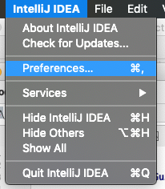

Select the plugins section in the preferences menu:


Click the settings button on the right most point and select *Install
Plugin from Disk*:


Then select the zip file for the plugin from the download folder.

Plugin - User Guide {#_plugin_user_guide}
===================

This section provides an overview of the features available in
Lightrun's IntelliJ plugin.

Logging In {#_logging_in}
----------

After installing Lightrun we can expand the side drawer by clicking on
it. We can then login from the IDE using either the button on the top of
the side drawer or the right click menu option:


::: {.note}
Before logging-in we need to register in the backend server web UI
:::

This triggers the following login dialog:


Once we log in successfully the status button on the top right corner
should turn green:

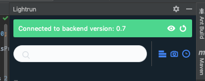

At this point the right click context menu changes and should include
additional options as such:


Usage {#_usage}
-----

::: {.important}
The plugin will hide options if there are no agents connected to the
backend and no tags
:::

On the right side we see the Lightrun side drawer. It includes a tree of
agents/tags and the actions connected to them:

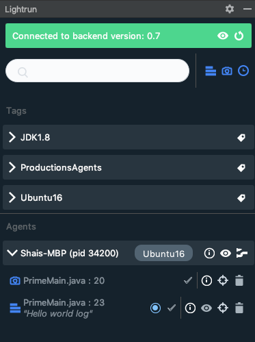

::: {.tip}
This drawer can be folded to save screen real estate
:::

The drawer includes all the high level information you might need:


We can search within agents and action below and the list updates
immediately based on the search query. When we have multiple logs on
multiple agents this can be very useful.

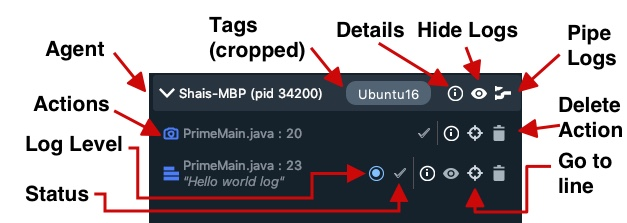

We have multiple indicators and capabilities for every agent. Most of
these are applicable for actions under tags as well so we'll focus only
on the agent here:

-   Tags --- this is the list of tags for this agent. Notice that it's
    cropped. To see all the tags we will need to expand the drawer or
    click the details (info) icon to see the list of tags there

-   Details --- shows the information dialog for the agent/action

-   Hide Logs --- Logs might be intrusive in the IDE UI. We can
    fold/hide them using this button. Notice it works recursively and
    will apply to the hierarchy below

-   Pipe Logs --- By default Lightrun logs into the same logger used by
    the host applicaion. However, it has 3 modes: `Server Only` (the
    default), `Plugin Only` and `Both`. When set to `Plugin Only` or
    `Both` logs added to this agent will show in the Lightrun console

-   Delete Action --- Allows us to delete an action. Notice that actions
    defined in a tag can be deleted through the tag only

-   Go to Line --- Jumps to the source/line number associated with the
    action

-   Status Indicator --- Indicates the current state of the action. One
    check box indicates the action was submitted to the server. Two
    check boxes indicate that it was received by the agent. Highlighted
    checkboxes indicate that the agent accepted the action and deems it
    valid

-   Log Level Indicator --- Indicates the log level from Info to Error

When we press the details button on an agent we can see the following
dialog with details about the piping mode, tags etc:


This is the equivalent dialog for a log entry:

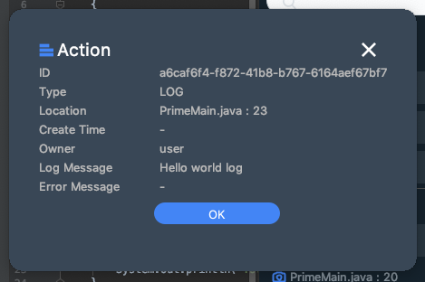

### Adding an Action {#_adding_an_action}

All actions are added via the right click menu. Select a specific line
in the code, right click and select the appropriate action e.g. Log as
shown here:


There are several options in the new/edit log dialog:

-   Agent --- The agent or tag to which we will bind the action

-   File/Line --- The actions position in the code

-   Format --- This is the actual log string. Notice we can use
    expressions such as `My variable is {var}` including even method
    invocations such as: `Method value: {myMethod() + 5}`

-   Log Level --- One of \"Debug\", \"Info\", \"Warning\" or \"Error\".
    We can then filter the logs based on this level

-   Condition --- an expression that limits the action, this is
    effectively the condition of an `if` statement we can use to limit
    the execution of the action e.g.: `myVar % 7 == 0` will limit the
    log so it will print only for variables that divide by 7

Once we press OK a log is added to the area above the line:


::: {.tip}
The picture on the left can be customized the at
[gravatar.com](https://en.gravatar.com/)
:::

Clicking the log lets us delete or edit it.

Almost all of this applies to the other actions supported by Lightrun.
So we'll review the other options by focusing on how they differ from
logs.

#### Snapshot (Breakpoint) {#_snapshot_breakpoint}

A snapshot is a one time \"breakpoint\" that doesn't block. It just
grabs the stack trace and variables then proceeds on its way.


Format and log level aren't needed in snapshots so they're unavailable
here. However, we have the expression list which lets us pick
expressions we wish to add to the snapshot.

The added snapshot is displayed in the gutter on the left side:

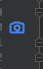

When the snapshot receives a hit it's shown in the bottom area of the
window in the *Lightrun Snapshots* area.


The snapshot result should be familiar to IntelliJ users as it's based
on the design of the debugger UI. The navigable stack trace is on the
left and the variable values are on the right. Watch expressions also
appear on the right hand side.

When the snapshot is deleted the content of the captured stack is also
removed.

#### Counter {#_counter}

We often want to know the number of times a specific line of code was
hit especially in comparison to a different line of code. This can be
very useful in debugging issues and especially in tracking performance
problems.

Counter does just that. It counts every time the given line was reached
and periodically logs that information to the standard logger.

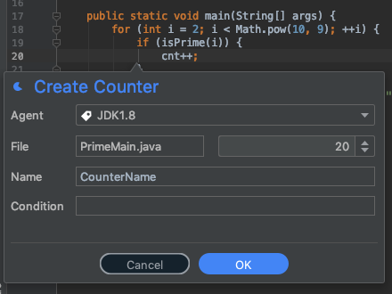

A counter doesn't have a format but it has a name which is used to in
the printouts to distinguish one counter from another.

::: {.tip}
Counter is impacted by the piping mode, so we can pipe the counter calls
to the IDE for convenience
:::

#### Set-Value {#_set_value}

One trick in debugging is the ability to set a variable to a different
value and force a specific code path. In our case this takes a much
deeper meaning of patching broken behavior. E.g. if a feature fails and
it's surrounded by an if statement we might be able to disable that
feature by setting the value of a variable.

This is an extremely risky proposition and as such it requires the
set-value role for a user. Otherwise the feature isn't available or even
visible.

When adding a set-value action we define a left side argument which is
the variable name and a right side element which is the value assigned.
The latter can be any valid expression including a method invocation.

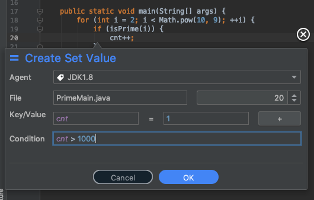

::: {.important}
Quotas aren't imposed on set-value operations and as such the
performance impact can be significant. Use this feature with caution
:::

Lightrun Console/Log Piping {#_lightrun_consolelog_piping}
---------------------------

Lightrun logs are normally printed into the standard logging framework.
This is quite valuable as logs can be seen in the context of
pre-existing log statements which might provide further nuance to solve
the problem.

However, in some cases a developer might want to see the log output in
the IDE. For that we have the Lightrun Console at the bottom of the
screen:


Logs created by Lightrun can be redirected to the console where we can
search and filter them. To do that we need to define log piping which we
define on a per-agent basis.


There are 3 levels of log piping:

-   App

-   Plugin

-   Both

App indicates the logs appear only in the Java application as they do by
default. They just go to the standard logger.

Plugin indicates that logs won't show in the app. Instead they will
display within the console below.

Both indicates that logs wll appear both in the app and in the plugin.

::: {.note}
In order to pipe the logs they need to go from the agent to the backend
server and to the plugin. This process is batched so logs appear in
batches and with some delay == Management Server
:::

Server Sign-up {#_server_sign_up}
--------------

Now that the backend server is running we need to create a user and
login. We need to navigate in the browser to the server.

::: {.note}
Notice that the URL is `https` and defaults to port `8080`. There should
be a self signed certificate warning from the browser! If you are having
issues accessing the server from your browser due to a certificate
blocking please follow the guidelines in the
`Troubleshooting certificates issues` section
:::

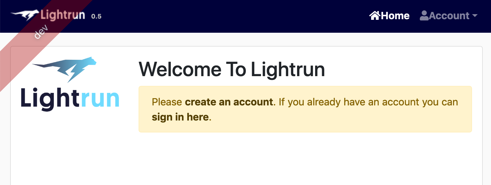

Under the account menu we can select register and create a new user
account.

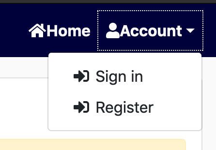

We can use any details as a verification email isn't sent at this time,
however values should be unique.

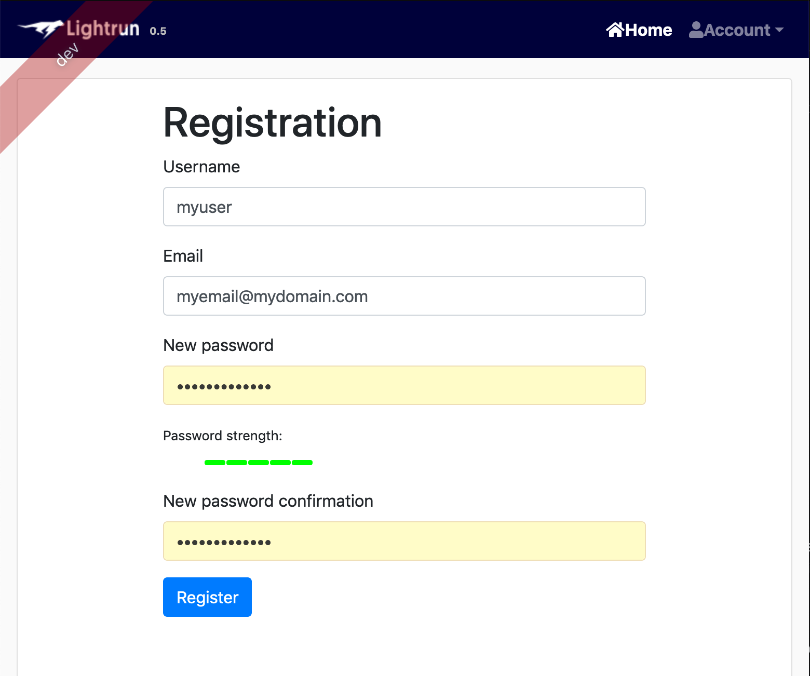

Once registered we can login immediately and should see this UI:


Notice this page is scrollable. It includes all of the important
instructions required for getting started.

Manager Role and Capabilities {#_manager_role_and_capabilities}
-----------------------------

::: {.note}
This section is only applicable for users with the manager role. You can
skip it if you don't have that role
:::

The backend server features several roles including: Manager, Set-Value
and User. A manager role has additional capabilities to manage
users/roles and more.

When logged in as a manager we have two additional menus in the top:
Manager and Entities. Entities provide information about the currently
connected agents, logs and tags. The manager menu provides three
options:

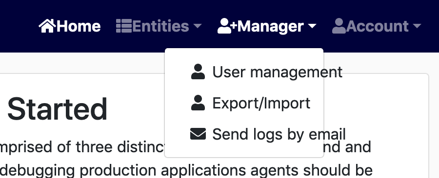

User management lets us add a new user or delete/edit an existing user.


One important feature is the ability to define the role for the created
user. It's crucial to provide the right roles to a user otherwise the
user won't be able to do anything!

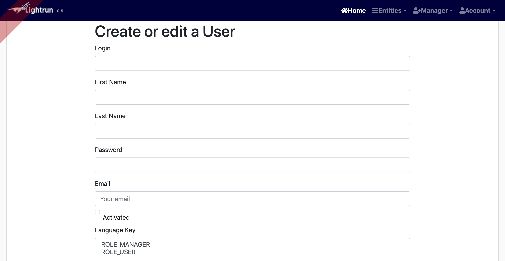

In case of a server side error send logs provides an easy way to send
logs by email directly from the web UI.


The entities menu includes three editable entries, tags is one such
entry. The web UI lets us delete tags that are no longer used.


We can disable breakpoints insertion in files that might expose
sensitive data by configuring blacklist.\
Files and packages in blacklist section that don't appear in exception
section will be protected from breakpoints insertion.\
On agent startup the blacklist configuration is downloaded and applied
to future actions, which means patterns modifications here require agent
restart.\
All users can view the configured blacklist and exceptions. The manager
can also create and delete patterns.


Usage {#_usage_2}
-----

Now we can start debugging our application:

**Step 1 - Launch the backend.**

In the server run: `service lightrund start` or `docker-compose up -d`.

::: {.tip}
Server's logs can be found under `/tmp/lightrun-backend-server.log`.
:::

**Step 2 - Launch an Agent.**

Next we need to run at least one application instance with the agent
attached. To do that we need to (add a runtime flag to the java
application):

`java -agentpath:<install_dir>/agent/lightrun_agent.so java-app`\

::: {.note}
Make sure to replace `<install_dir>` with the installation directory
:::

**Step 3 - Debug.**

While the application is running we can use the plugin/CLI to add
actions and debug the app. Check our the rest of the guide for
instructions on using both.

Agent {#_agent}
=====

The agent is at the core of Lightrun. Setting up agents is the most
important task once the backend is in place.

::: {.tip}
For elaborate agent setups please check out the [Agent
Integrations](#integrations).
:::

Tagging {#_tagging}
-------

Tagging lets us group agents together for common functionality unde as they do in the source directory.