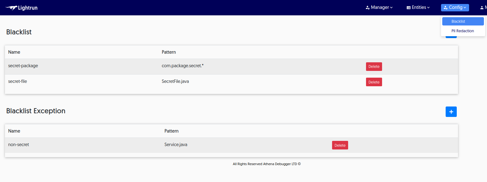

Motivation {#_motivation}
==========

To identify the root cause of a production problem (logical bug,
performance issue, downtime, etc.), developers either:

1.  Review runtime logs / performance metrics

2.  Attempt to reproduce the problem in a development / test environment

Log files and APM solutions are great sources of information - they can
often identify defects in an application, but they're mostly defined
during the development stage. With the adoption of microservices and
serverless architectures, the gap between production and development
environment widens. This gap makes it hard to reproduce or anticipate
production-only issues. Lightrun bridges the gap between development and
production debugging.

**Lightrun bridges the gap between development and production
debugging.**

Overview {#_overview}
--------

Lightrun is divided into 3 parts:

1.  **Java Agent** - JVMTI agent that runs alongside the application
    which is responsible for the dynamic insertion of commands.

2.  **Backend Server** - Lightruns server. Responsible for service
    management

3.  **Client** - IDE plugin and command line utility both of which let
    us add, remove and modify the actions


Limitation {#_limitation}
----------

Some debug information might be missing due to compiler's effort to
reduce the binary size. Hence, not all the variables will be visible for
exploration.

Enhancing the debug information is **highly recommended**. We can
achieve that by adding `-g` flag to the compilation command.

If the project uses Maven we should add the following lines to
`pom.xml`:

``` {.xml}
<compilerArgs>
    <arg>-g:source,lines</arg>
</compilerArgs>
```

This flag will have no impact on the compiler optimization. It will only
enhance the bytecode with additional debug info. As such the performance
of the app will remain the same.

Installation - Getting started {#_installation_getting_started}
==============================

Lightrun consists of three main components:

1.  Management Server

2.  Agent

3.  Client - CLI and Plugin

Once the backend is installed we can create a user account. We can then
login with this new account and follow the instructions to install the
agent, plugin and CLI.

::: {.tip}
The backend defaults to port 8080 and requires HTTPS so the URL should
look like <https://192.168.1.108:8080/>
:::

::: {.important}
We will receive an HTTPS warning in the browser and will need to add an
exception for this URL. SSL certificates can be applied to domains only
and will produce a warning for in-house servers!
:::

Management Server Deployment - Docker Compose {#_management_server_deployment_docker_compose}
---------------------------------------------

Lightrun's management server works best in a container environment.
Running Lightrun is as easy as running a single command from the
terminal. We can run the backend server on any host using docker-compose
or other container orchestration tool such as Kubernetes, Docker Swarm
or Rancher etc.

The easiest way to deploy the server is to run the docker-compose file.
Copy the two `yml` files provided into an empty directory and execute:

``` {.bash}
cd {docker-compose-directory}
docker-compose up -d
```

In case port 8080 is already taken, we can change the port number in the
docker-compose file.

Agent Deployment {#_agent_deployment}
----------------

The agent can be downloaded from the backend server page once we login
to the backend.

In order to use the agent in an app, download and extract the zip in the
apps server.

::: {.important}
The following code is available in the backend welcome page and should
be copied from there as the `server-ip` and port value will be set
correctly
:::

``` {.bash}
wget --no-check-certificate https://server-ip:8080/content/files/agent.zip&host=server-ip&port=8080 -O agent.zip
mkdir agent
unzip agent.zip -d agent
```

::: {.tip}
Check out the content of the file `agent/agent.config`. It includes many
setting options including the backend server URL
:::

### Attaching the Agent {#_attaching_the_agent}

Now we add the agent to the java application by changing the command
line as such:

``` {.bash}
java -agentpath:/path/to/agent/lightrun_agent.so RestOfTheArgumentsHere
```

Alternatively we can add the `JAVA_OPTS` environment variable to the
server so all java processes launched in the server would have an agent
attached as such:

``` {.bash}
export JAVA_OPTS=-agentpath:/path/to/agent/lightrun_agent.so
```

Once an agent is running we can move to the IntelliJ plugin
installation.

Plugin Installation {#_plugin_installation}
-------------------

To install the plugin download the plugin zip from the Lightrun backend.

::: {.important}
Don't unzip the file!
:::

Open IntelliJ's preferences:


Select the plugins section in the preferences menu:


Click the settings button on the right most point and select *Install
Plugin from Disk*:


Then select the zip file for the plugin from the download folder.

Plugin - User Guide {#_plugin_user_guide}
===================

This section provides an overview of the features available in
Lightrun's IntelliJ plugin.

Logging In {#_logging_in}
----------

After installing Lightrun we can expand the side drawer by clicking on
it. We can then login from the IDE using either the button on the top of
the side drawer or the right click menu option:


::: {.note}
Before logging-in we need to register in the backend server web UI
:::

This triggers the following login dialog:


Once we log in successfully the status button on the top right corner
should turn green:


At this point the right click context menu changes and should include
additional options as such:


Usage {#_usage}
-----

::: {.important}
The plugin will hide options if there are no agents connected to the
backend and no tags
:::

On the right side we see the Lightrun side drawer. It includes a tree of
agents/tags and the actions connected to them:


::: {.tip}
This drawer can be folded to save screen real estate
:::

The drawer includes all the high level information you might need:


We can search within agents and action below and the list updates
immediately based on the search query. When we have multiple logs on
multiple agents this can be very useful.


We have multiple indicators and capabilities for every agent. Most of
these are applicable for actions under tags as well so we'll focus only
on the agent here:

-   Tags --- this is the list of tags for this agent. Notice that it's
    cropped. To see all the tags we will need to expand the drawer or
    click the details (info) icon to see the list of tags there

-   Details --- shows the information dialog for the agent/action

-   Hide Logs --- Logs might be intrusive in the IDE UI. We can
    fold/hide them using this button. Notice it works recursively and
    will apply to the hierarchy below

-   Pipe Logs --- By default Lightrun logs into the same logger used by
    the host applicaion. However, it has 3 modes: `Server Only` (the
    default), `Plugin Only` and `Both`. When set to `Plugin Only` or
    `Both` logs added to this agent will show in the Lightrun console

-   Delete Action --- Allows us to delete an action. Notice that actions
    defined in a tag can be deleted through the tag only

-   Go to Line --- Jumps to the source/line number associated with the
    action

-   Status Indicator --- Indicates the current state of the action. One
    check box indicates the action was submitted to the server. Two
    check boxes indicate that it was received by the agent. Highlighted
    checkboxes indicate that the agent accepted the action and deems it
    valid

-   Log Level Indicator --- Indicates the log level from Info to Error

When we press the details button on an agent we can see the following
dialog with details about the piping mode, tags etc:


This is the equivalent dialog for a log entry:


### Adding an Action {#_adding_an_action}

All actions are added via the right click menu. Select a specific line
in the code, right click and select the appropriate action e.g. Log as
shown here:


There are several options in the new/edit log dialog:

-   Agent --- The agent or tag to which we will bind the action

-   File/Line --- The actions position in the code

-   Format --- This is the actual log string. Notice we can use
    expressions such as `My variable is {var}` including even method
    invocations such as: `Method value: {myMethod() + 5}`

-   Log Level --- One of \"Debug\", \"Info\", \"Warning\" or \"Error\".
    We can then filter the logs based on this level

-   Condition --- an expression that limits the action, this is
    effectively the condition of an `if` statement we can use to limit
    the execution of the action e.g.: `myVar % 7 == 0` will limit the
    log so it will print only for variables that divide by 7

Once we press OK a log is added to the area above the line:


::: {.tip}
The picture on the left can be customized the at
[gravatar.com](https://en.gravatar.com/)
:::

Clicking the log lets us delete or edit it.

Almost all of this applies to the other actions supported by Lightrun.
So we'll review the other options by focusing on how they differ from
logs.

#### Snapshot (Breakpoint) {#_snapshot_breakpoint}

A snapshot is a one time \"breakpoint\" that doesn't block. It just
grabs the stack trace and variables then proceeds on its way.


Format and log level aren't needed in snapshots so they're unavailable
here. However, we have the expression list which lets us pick
expressions we wish to add to the snapshot.

The added snapshot is displayed in the gutter on the left side:


When the snapshot receives a hit it's shown in the bottom area of the
window in the *Lightrun Snapshots* area.


The snapshot result should be familiar to IntelliJ users as it's based
on the design of the debugger UI. The navigable stack trace is on the
left and the variable values are on the right. Watch expressions also
appear on the right hand side.

When the snapshot is deleted the content of the captured stack is also
removed.

#### Counter {#_counter}

We often want to know the number of times a specific line of code was
hit especially in comparison to a different line of code. This can be
very useful in debugging issues and especially in tracking performance
problems.

Counter does just that. It counts every time the given line was reached
and periodically logs that information to the standard logger.


A counter doesn't have a format but it has a name which is used to in
the printouts to distinguish one counter from another.

::: {.tip}
Counter is impacted by the piping mode, so we can pipe the counter calls
to the IDE for convenience
:::

#### Set-Value {#_set_value}

One trick in debugging is the ability to set a variable to a different
value and force a specific code path. In our case this takes a much
deeper meaning of patching broken behavior. E.g. if a feature fails and
it's surrounded by an if statement we might be able to disable that
feature by setting the value of a variable.

This is an extremely risky proposition and as such it requires the
set-value role for a user. Otherwise the feature isn't available or even
visible.

When adding a set-value action we define a left side argument which is
the variable name and a right side element which is the value assigned.
The latter can be any valid expression including a method invocation.


::: {.important}
Quotas aren't imposed on set-value operations and as such the
performance impact can be significant. Use this feature with caution
:::

Lightrun Console/Log Piping {#_lightrun_consolelog_piping}
---------------------------

Lightrun logs are normally printed into the standard logging framework.
This is quite valuable as logs can be seen in the context of
pre-existing log statements which might provide further nuance to solve
the problem.

However, in some cases a developer might want to see the log output in
the IDE. For that we have the Lightrun Console at the bottom of the
screen:


Logs created by Lightrun can be redirected to the console where we can
search and filter them. To do that we need to define log piping which we
define on a per-agent basis.


There are 3 levels of log piping:

-   App

-   Plugin

-   Both

App indicates the logs appear only in the Java application as they do by
default. They just go to the standard logger.

Plugin indicates that logs won't show in the app. Instead they will
display within the console below.

Both indicates that logs wll appear both in the app and in the plugin.

::: {.note}
In order to pipe the logs they need to go from the agent to the backend
server and to the plugin. This process is batched so logs appear in
batches and with some delay == Management Server
:::

Server Sign-up {#_server_sign_up}
--------------

Now that the backend server is running we need to create a user and
login. We need to navigate in the browser to the server.

::: {.note}
Notice that the URL is `https` and defaults to port `8080`. There should
be a self signed certificate warning from the browser! If you are having
issues accessing the server from your browser due to a certificate
blocking please follow the guidelines in the
`Troubleshooting certificates issues` section
:::


Under the account menu we can select register and create a new user
account.


We can use any details as a verification email isn't sent at this time,
however values should be unique.


Once registered we can login immediately and should see this UI:


Notice this page is scrollable. It includes all of the important
instructions required for getting started.

Manager Role and Capabilities {#_manager_role_and_capabilities}
-----------------------------

::: {.note}
This section is only applicable for users with the manager role. You can
skip it if you don't have that role
:::

The backend server features several roles including: Manager, Set-Value
and User. A manager role has additional capabilities to manage
users/roles and more.

When logged in as a manager we have two additional menus in the top:
Manager and Entities. Entities provide information about the currently
connected agents, logs and tags. The manager menu provides three
options:


User management lets us add a new user or delete/edit an existing user.


One important feature is the ability to define the role for the created
user. It's crucial to provide the right roles to a user otherwise the
user won't be able to do anything!


In case of a server side error send logs provides an easy way to send
logs by email directly from the web UI.


The entities menu includes three editable entries, tags is one such
entry. The web UI lets us delete tags that are no longer used.


We can disable breakpoints insertion in files that might expose
sensitive data by configuring blacklist.\
Files and packages in blacklist section that don't appear in exception
section will be protected from breakpoints insertion.\
On agent startup the blacklist configuration is downloaded and applied
to future actions, which means patterns modifications here require agent
restart.\
All users can view the configured blacklist and exceptions. The manager
can also create and delete patterns.




Usage {#_usage_2}
-----

Now we can start debugging our application:

**Step 1 - Launch the backend.**

In the server run: `service lightrund start` or `docker-compose up -d`.

::: {.tip}
Server's logs can be found under `/tmp/lightrun-backend-server.log`.
:::

**Step 2 - Launch an Agent.**

Next we need to run at least one application instance with the agent
attached. To do that we need to (add a runtime flag to the java
application):

`java -agentpath:<install_dir>/agent/lightrun_agent.so java-app`\

::: {.note}
Make sure to replace `<install_dir>` with the installation directory
:::

**Step 3 - Debug.**

While the application is running we can use the plugin/CLI to add
actions and debug the app. Check our the rest of the guide for
instructions on using both.

Agent {#_agent}
=====

The agent is at the core of Lightrun. Setting up agents is the most
important task once the backend is in place.

::: {.tip}
For elaborate agent setups please check out the [Agent
Integrations](#integrations).
:::

Tagging {#_tagging}
-------

Tagging lets us group agents together for common functionality under a
meaningful name. E.g. Database Servers, Staging, 18GB Machines etc.

We can use any set of tags to define an agent. This would allow binding
actions to an agent even before it was launched as well as applying an
action to a cross section of servers.

We tag an agent by editing the file `agent.metadata.json` e.g.:

``` {.json}
{
    "registration": {
      "tags": [
        {
          "name": "ProductionsAgents"
        },
        {
          "name": "JDK1.8"
        },
        {
          "name": "Ubuntu16"
        }
      ]
    }
}
```

We can add/remove entries within the \"tags\" section.

::: {.note}
Changes to this file aren't detected dynamically. An agent restart would
be required
:::

Once we bind an action to a tag it will be added implicitly to the
tagged agents. This can be useful for many cases. E.g. integration tests
can execute with a specific tag, that lets us debug an integration test
failure by binding an action based on a tag.

Tags can also be defined in the command line e.g.

``` {.bash}
java -Dlightrun.registration.tags=myTag -agentpath:/path/to/agent/lightrun_agent.so RestOfTheArgumentsHere
```

Customization {#_customization}
-------------

### Dynamic Logger {#_dynamic_logger}

The inserted logs are printed using `java.util.logging` logger. You can
customize the log prints by adding
`-Djava.util.logging.config.file=/path/to/app.properties` to the command
line.

### Agent Config {#_agent_config}

There are a few parameters we can tune in order to change the agent
configuration. The configuration file is located under
`<install_dir>/agent/agent.config`.

+-----------------------------------+-----------------------------------+
| Parameter Name                    | Explanation                       |
+===================================+===================================+
| `max_dynamic_log_rate`            | Number of log prints per second   |
|                                   | (on average).                     |
+-----------------------------------+-----------------------------------+
| `max_dynamic_log_bytes_rate`      | Number of bytes per second (on    |
|                                   | average).                         |
+-----------------------------------+-----------------------------------+
| `log_stats_time_micros`           | How often to log debugger         |
|                                   | performance stats.                |
+-----------------------------------+-----------------------------------+
| `max_condition_cost`              | Maximum cost in percentage of CPU |
|                                   | consumption of condition          |
|                                   | evaluation.                       |
+-----------------------------------+-----------------------------------+
| `max_log_cpu_cost`                | Maximum cost of dynamic logging   |
|                                   | in percentage of CPU consumption  |
|                                   | (short bursts are allowed).       |
+-----------------------------------+-----------------------------------+
| `max_snapshot_buffer_size`        | The total size in bytes we allow  |
|                                   | to evaluate when capturing a      |
|                                   | snapshot                          |
+-----------------------------------+-----------------------------------+
| `max_snapshot_frame_count`        | Max frame count we allow to       |
|                                   | collect data from when capturing  |
|                                   | a snapshot                        |
+-----------------------------------+-----------------------------------+
| `breakpoint_expiration_sec`       | Breakpoint \\ Dynamic log         |
|                                   | expiration in seconds.            |
+-----------------------------------+-----------------------------------+
| `dynamic_log_quota_recovery_ms`   | Time to pause dynamic log after   |
|                                   | it runs out of quota.             |
+-----------------------------------+-----------------------------------+
| `no_check_certificate`            | Disable certificate pinning when  |
|                                   | accessing the backend             |
+-----------------------------------+-----------------------------------+
| `ignore_quota`                    | Disable all performance safe      |
|                                   | guards when evaluating a          |
|                                   | breakpoint. **Not Recommended**   |
+-----------------------------------+-----------------------------------+
| `exceptions_monitoring_enabled`   | Enable the capturing of the       |
|                                   | application's exceptions          |
+-----------------------------------+-----------------------------------+
| `exceptions_monitoring_stdout`    | Print all of the captured         |
|                                   | exceptions to the standard output |
+-----------------------------------+-----------------------------------+
| `exceptions_report_percentage`    | Process and report only this      |
|                                   | percentage of the exceptions      |
|                                   | thrown by the debuggee (A float   |
|                                   | between 0 and 1.0).               |
+-----------------------------------+-----------------------------------+
| `exceptions_should_report_caught` | Report exceptions that were       |
|                                   | caught by the application as well |
|                                   | as exceptions that remained       |
|                                   | uncaught                          |
+-----------------------------------+-----------------------------------+
| `exceptions_max_buffer_size`      | The total size in bytes we allow  |
|                                   | to evaluate when capturing an     |
|                                   | excpetion (Same as snapshot)      |
+-----------------------------------+-----------------------------------+
| `ex                               | Max frame count we allow to       |
| ceptions_stack_trace_frame_count` | collect data from when capturing  |
|                                   | an excpetion (Same as snapshot)   |
+-----------------------------------+-----------------------------------+
| `enable_pii_redaction`            | Enable PII redaction in the       |
|                                   | agent's side (may have an effect  |
|                                   | on the application's performance) |
+-----------------------------------+-----------------------------------+

### Agent Command line arguments {#_agent_command_line_arguments}

Some configurations can be changed with a command line argument. The
command line args come after the agent's path and are separated by a
comma:
`` `-agentpath:<path-to-agent>/lightrun_agent.so=--lightrun_wait_for_init,--lightrun_init_wait_time_ms=5000` ``

+----------------------+----------------------+-----------------------+
| Parameter Name       | Explanation          | Type                  |
+======================+======================+=======================+
| `hub_retry_delay_ms` | amount of time in    | int32                 |
|                      | milliseconds to      |                       |
|                      | sleep before         |                       |
|                      | retrying failed      |                       |
|                      | requests to backend  |                       |
+----------------------+----------------------+-----------------------+
| `debugge             | amount of time in    | int32                 |
| e_disabled_delay_ms` | milliseconds to      |                       |
|                      | sleep before         |                       |
|                      | checking whether the |                       |
|                      | debugger was enabled |                       |
|                      | back                 |                       |
+----------------------+----------------------+-----------------------+
| `lightr              | additional           | string                |
| un_extra_class_path` | directories and      |                       |
|                      | files containing     |                       |
|                      | resolvable binaries  |                       |
+----------------------+----------------------+-----------------------+
| `lightru             | timeout for wait if  | int32                 |
| n_init_wait_time_ms` | li                   |                       |
|                      | ghtrun_wait_for_init |                       |
|                      | is set               |                       |
+----------------------+----------------------+-----------------------+
| `lig                 | Block application    | bool                  |
| htrun_wait_for_init` | until first time of  |                       |
|                      | fetching breakpoints |                       |
|                      | from the server      |                       |
+----------------------+----------------------+-----------------------+
| `enable_safe_caller` | Allows any method    | bool                  |
|                      | without side effects |                       |
|                      | in expressions       |                       |
+----------------------+----------------------+-----------------------+
| `ex                  | Additional methods   | string                |
| tra_blocked_methods` | to block for testing |                       |
|                      | purposes             |                       |
+----------------------+----------------------+-----------------------+
| `ex                  | Additional methods   | string                |
| tra_allowed_methods` | to allowed for       |                       |
|                      | testing purposes     |                       |
+----------------------+----------------------+-----------------------+
| `extra_              | Internal names of    | string                |
| whitelisted_classes` | additional classes   |                       |
|                      | to allow for testing |                       |
|                      | purposes             |                       |
+----------------------+----------------------+-----------------------+
| `expression_max      | Maximum number of    | int32                 |
| _classes_load_quota` | classes that the     |                       |
|                      | NanoJava interpreter |                       |
|                      | is allowed to load   |                       |
|                      | while evaluating a   |                       |
|                      | single breakpoint    |                       |
|                      | expression           |                       |
+----------------------+----------------------+-----------------------+
| `expres              | Maximum number of    | int32                 |
| sion_max_interpreter | instructions that    |                       |
| _instructions_quota` | the NanoJava         |                       |
|                      | interpreter is       |                       |
|                      | allowed to execute   |                       |
|                      | while evaluating a   |                       |
|                      | single breakpoint    |                       |
|                      | expression           |                       |
+----------------------+----------------------+-----------------------+
| `pretty_printers_max | Maximum number of    | int32                 |
| _classes_load_quota` | classes that the     |                       |
|                      | NanoJava interpreter |                       |
|                      | is allowed to load   |                       |
|                      | while formatting     |                       |
|                      | some well known data |                       |
|                      | structures           |                       |
+----------------------+----------------------+-----------------------+
| `pretty_prin         | Maximum number of    | int32                 |
| ters_max_interpreter | instructions that    |                       |
| _instructions_quota` | the NanoJava         |                       |
|                      | interpreter is       |                       |
|                      | allowed to execute   |                       |
|                      | while formatting     |                       |
|                      | some well known data |                       |
|                      | structures           |                       |
+----------------------+----------------------+-----------------------+
| `dynamic_log_max     | Maximum number of    | int32                 |
| _classes_load_quota` | classes that the     |                       |
|                      | NanoJava interpreter |                       |
|                      | is allowed to load   |                       |
|                      | while evaluating all |                       |
|                      | expressions in a     |                       |
|                      | single dynamic log   |                       |
|                      | statement            |                       |
+----------------------+----------------------+-----------------------+
| `dynamic             | Maximum number of    | int32                 |
| _log_max_interpreter | instructions that    |                       |
| _instructions_quota` | the NanoJava         |                       |
|                      | interpreter is       |                       |
|                      | allowed to execute   |                       |
|                      | while evaluating all |                       |
|                      | expressions in a     |                       |
|                      | single dynamic log   |                       |
+----------------------+----------------------+-----------------------+
| `safe_caller         | Maximum allowed size | int32                 |
| _max_array_elements` | of the array to copy |                       |
|                      | or allocate in safe  |                       |
|                      | caller (copying or   |                       |
|                      | allocating larger    |                       |
|                      | arrays is considered |                       |
|                      | to be too expensive  |                       |
|                      | MISSING              |                       |
+----------------------+----------------------+-----------------------+
| `                    | Maximum stack depth  | int32                 |
| safe_caller_max_inte | that safe caller     |                       |
| rpreter_stack_depth` | will allow           |                       |
+----------------------+----------------------+-----------------------+
| `cdbg                | additional text to   | string                |
| _description_suffix` | be appended to       |                       |
|                      | debuggee description |                       |
+----------------------+----------------------+-----------------------+
| `cdbg_cla            | Cache size for class | int32                 |
| ss_files_cache_size` | files used in safe   |                       |
|                      | method caller        |                       |
+----------------------+----------------------+-----------------------+
| `cdbg_ma             | Use this value when  | int32                 |
| x_instructions_high` | ignoring quota       |                       |
+----------------------+----------------------+-----------------------+
| `c                   | Maximum number of    | int32                 |
| dbg_max_stack_depth` | stack frames to      |                       |
|                      | unwind               |                       |
+----------------------+----------------------+-----------------------+

### Metrics {#_metrics}

The agent runs alongside a production application. Hence, it's crucial
to monitor and collect important metrics about the overhead of the
agent.

The agent prints to it's own log file (usually
`/tmp/lightrun_java_agent.INFO`) statistics every
`log_stats_time_micros` microseconds.

Listed below are some reported metrics based on the agents logfile.

#### StatsD {#_statsd}

Statsd is a network deamon listens for statistics over UDP or TCP and
aggregates the data into different backends (e.g Graphite).

There's a short script that performs on-line metric scraping from agent
log file (usually `/tmp/lightrun_java_agent.INFO`).

``` {.bash}
cd <install-dir>/agent/stats/
./statsd_reporter.py --host <statsd-hostname> --port <statsd-port> --logfile <agent-log-file.txt>
```

Exceptions Monitoring {#exceptions}
=====================

Lightrun has the ability to monitor all the exceptions thrown in the
application and give insights about them.

**Note:** By default, every exception in the application will be
reported, even ones that get caught along the way.

Configuring the Agent {#_configuring_the_agent}
---------------------

In order to configure the agent to report the exceptions to the server
follow these steps:

1.  Go to the folder of the agent

2.  Open the `agent.config` file

3.  Find the property `exceptions_monitoring_enabled` and set it to `1`.
    It should look like this: `exceptions_monitoring_enabled=1`

4.  In case you want the agent to ignore exceptions that are caught
    along the way, find and set the `exceptions_should_report_caught`
    property to `0`.

5.  Restart your application with the agent

The Server {#_the_server}
----------

In the server you'll be able to see general statistics about the
exceptions and details of specific exceptions. To view the exceptions
table, click Exceptions → Data


In this page you'll be able to see a table with statistics on all the
exceptions thrown by all your applications.


In the top right corner of the screen there are search options. You can
search with free text and by specific time frames or by custom range.


Clicking on a specific type of exception in the table will open a modal
with more details on the exception. Clicking on a specific exception in
the table (or navigating using the \"Previous/Next Exception\" buttons
above) you'll be able to see the stacktrace of each specific exception,
and for each frame in the stacktrace you can see the snapshot of the
frame.


The Plugin {#_the_plugin}
----------

In order to view the exceptions in the plugin click on the
\"Exceptions\" tab at the bottom of the Lightrun window


In this view you can view exceptions from today and exceptions from the
last month.

Email Notifications {#_email_notifications}
-------------------

Lightrun can send you alerts to inform you on what is going on with the
exceptions in your applications. The alerts can be recurring
(weekly/daily) or they can be on various events that happened. To
configure these alerts go to \"Email Alerts\" at the menu bar.


Agent Integrations {#integrations}
==================

Every application server has its own way of customizing jvm arguments.

Tomcat {#_tomcat}
------

In order to configure Tomcat to use Lightruns agent we need to add the
path to the app war file as an additional parameter to the JAVA_OPTS:

``` {.shell}
-agentpath:<install_dir>/agent/lightrun_agent.so=--lightrun_extra_class_path=<tomcat-path>/webapps/<app-name.war>
```

Please restart the server:

``` {.shell}
./catalina.sh stop
./catalina.sh start
```

**Note:**

1.  This will make the Agent to run every time the webserver restarts.

2.  Tomcat autodeploy will not start a new agent. Therefore, after an
    autodeploy new insertions will not affect the application.

GlassFish {#_glassfish}
---------

In order to configure GlassFish to use Lightruns agent we need to add
the following to the runtime jvm options:

``` {.shell}
-agentpath:<install_dir>/agent/lightrun_agent.so=--lightrun_extra_class_path=<glassfish-domain-path>/applications/<app-name>/WEB-INF/classes/
```

There are several methods to add this jvm option:

1.  **Through the Admin panel (usually <http://localhost:4848>)**\
    Configurations → server-config → JVM Options tab.\

2.  **GlassFish CLI**\
    `asadmin create-jvm-options <new-jvm-option>`\

3.  **Manually**\
    Add the JVM option to `<glassfish-domain-path>/config/domain.xml`.

**Note:**

1.  This will make the Agent to run every time the webserver restarts.

2.  Glassfish autodeploy will not start a new agent. Therefore, after an
    autodeploy new insertions will not affect the application.

WildFly {#_wildfly}
-------

In order to configure WildFly to use Lightruns agent we need to add the
path to the app war file as an additional parameter to the JAVA_OPTS:

``` {.shell}
-agentpath:<install_dir>/agent/lightrun_agent.so=--lightrun_extra_class_path=<widlfly-deploy-path>/<app-name.war>. e.g. '--lightrun_extra_class_path=/opt/jboss/wildfly/standalone/deployments/myapp.war'
```

The following is checked on CentOS 7.6/WildFly 18 (official WildFly
Docker image)

1.  The JAVA_OPTS is in the standalone.conf file which is in
    `/opt/jboss/wildfly/bin/`

2.  The default server logs are in
    `/opt/jboss/wildfly/standalone/log/server.log`

3.  To deploy the app copy a .war file to the deployment dir
    `/opt/jboss/wildfly/standalone/deployments/`

4.  To redeploy an app, copy a new file to the deployment dir and then
    run `touch <app_name>.war` in the same dir. Then see
    `/opt/jboss/wildfly/standalone/log/server.log` to verify

5.  The above approach will stop agent from functioning properly

6.  To make it work, restart the WildFly - [How to start/stop the
    WildFly
    server](https://subscription.packtpub.com/book/networking_and_servers/9781784392413/2/ch02lvl1sec29/shutting-down-and-restarting-an-instance-via-the-cli)

Jetty {#_jetty}
-----

We need to create a new file `/var/lib/jetty/start.d/lightrun.ini` with
the following content:

``` {.bash}
--exec
-agentpath:<install_dir>/agent/lightrun_agent.so
```

Weblogic {#_weblogic}
--------

In order to configure Weblogic to use Lightruns agent we need to:

1.  Add the path to the app ear file as an additional parameter to the
    JAVA_OPTS:

``` {.shell}
-agentpath:<install_dir>/agent/lightrun_agent.so=--lightrun_extra_class_path=<weblogic-deploy-path>/<app-name.ear>. e.g. '--lightrun_extra_class_path=Oracle/Middleware/user_projects/domains/mydomain/deployments/myapp.ear'
```

1.  Tell Weblogic server to use the sun Http Handlers and not install
    its own:

``` {.shell}
-DUseSunHttpHandler=true
```

There are several methods to add those jvm options:

1.  **To all servers**\
    Add the JVM option to
    `Oracle/Middleware/user_projects/domains/<your-domain>/bin/setDomainEnv.sh`
    where JAVA_OPTIONS is set

2.  **Through the Admin panel (usually
    <http://localhost:7001/console>)**\
    Press Lock & Edit, then: Environment → Servers → \<Wanted-Server\> →
    Server Start → Arguments\

**Note:**

This will make the Agent run every time the server restarts.

Server Integrations
===================

\"Lightrun comes with working integrations for some of leading
monitoring, alerting and communication platforms. The list of supported
integrations is constantly expanding. You can see the updated list of
the integrations and configure each of them through the Integrations
panel (*Manager* → *System Integrations*)

::: {.note}
Manager role is required to edit integrations\"
:::


::: {.note}
To see an agent data sent to any of the configured integration, please
make sure it's piping status is set to either \"Plugin\" or \"Both\".
:::

Statsd {#_statsd_2}
------


1.  Press \"Connect\" button on Statsd configuration widget

2.  Fill \"Server\" and \"UDP Port\" fields with the relevant values
    (default values are displayed)

3.  Press \"Connect\" button and make sure you see the approval toast
    message

4.  Press \"Disconnect\" button to disable the configuration

Prometheus {#_prometheus}
----------


1.  Press \"Connect\" button on Prometheus configuration widget

2.  Copy the scrape config to your prometheus.yml file

3.  Press \"Activate\" button and make sure you see the approval toast
    message

4.  To disable the integration, remove the scrape config from the
    prometheus.yaml file or press \"Deactivate\" button

Datadog {#_datadog}
-------


1.  Press \"Connect\" button on Datadog configuration widget

2.  Add your Datadog API key

3.  Press \"Connect\" button and make sure you see the approval toast
    message

4.  To disable the integration press \"Disconnect\" button

Logz.io {#_logz_io}
-------


1.  Press \"Connect\" button on Logz.io configuration widget

2.  Fill \"URL\", \"Company\" and \"Type\" fields with the relevant
    values (default values are displayed)

3.  Add your Logz.io token (no default value displayed)

4.  Press \"Connect\" button and make sure you see the approval message

5.  To disable the integration, press \"Disconnect\" button

FAQ {#_faq}
---

1.  Make sure the agent piping status set to either \"Plugin\" or
    \"Both\".

2.  Wait a few minutes after sending your logs to give the platform time
    to index and make them available for search. It normally happens
    from within seconds to one minute, but sometimes it can take longer.

3.  Check for network connectivity issues, e.g. firewall configurations

**Q: I see error toast messages when pressing \"Connect\" or the
\"Activate\" button..**

    Make sure you provide proper values for the related fields. Please refer one fo the following:

-   [StatsD README](https://github.com/statsd/statsd)

-   [Prometheus FAQ](https://prometheus.io/docs/introduction/faq/)

-   [Datadog Log Collection Troubleshooting
    Guide](https://docs.datadoghq.com/logs/guide/log-collection-troubleshooting-guide/)

-   [Logz.io shipping troubleshooting
    guide](https://docs.logz.io/user-guide/log-shipping/log-shipping-troubleshooting.html)

Troubleshooting {#_troubleshooting}
===============

Common issues include the following.

**Agents don't show up in IDE.**

Try:

-   Restarting the IDE

-   Logging in again

**Username Field is Disabled in Login.**

Try:

-   Make sure the backend server is reachable

-   Make sure the URL/port were typed correctly

-   Try deleting and retyping a character in the URL to trigger
    validation again

-   Make sure there are no hidden characters/spaces before/after the URL


This notification warning pops up when one or more actions in the open
file were set against different source code. This might happen if you
set an action after making edits to the file, or if an action was set to
the same file by another person whose source code differs from yours.

This warning can be ignored, as it doesn't block the activation of the
action. However, actions set on mismatching source code can cause
unexpected behavior, so it is recommended to solve the issue.

To solve the issue, make sure that the application you are debugging is
the same as the code in your editor (or the editor of whoever set the
action). If the problem persists, you can disable the warning by
clicking \"Don't Show this Again\" in the notification panel (Notice
that disabling this feature will also affect the actions the way other
people view the actions you set).

Certificates issues {#_certificates_issues}
-------------------

### Self-signed certificate is blocked {#_self_signed_certificate_is_blocked}

The troubleshooting may vary depends on either browser (also browser
version) or OS, and the following cover most of the popular browsers and
operating systems

1.  [Getting Chrome to accept self-signed localhost certificate (per
    Chrome
    version)](https://stackoverflow.com/questions/7580508/getting-chrome-to-accept-self-signed-localhost-certificate)

2.  [Ubuntu: Adding a self-signed certificate to the "trusted
    list"](https://unix.stackexchange.com/questions/90450/adding-a-self-signed-certificate-to-the-trusted-list)

3.  [Creating and Trusting Self-Signed Certs on MacOS and
    Chrome/Safari](https://www.andrewconnell.com/blog/updated-creating-and-trusting-self-signed-certs-on-macos-and-chrome/)

4.  [How to trust a self-signed SSL certificate in IE11 and
    Edge](https://medium.com/@ali.dev/how-to-trust-any-self-signed-ssl-certificate-in-ie11-and-edge-fa7b416cac68)

5.  [How do you get Chrome to accept a self-signed certificate on
    Win10](https://www.pico.net/kb/how-do-you-get-chrome-to-accept-a-self-signed-certificate)
