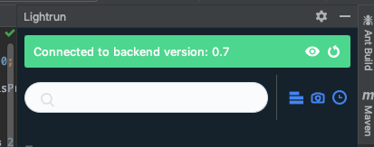
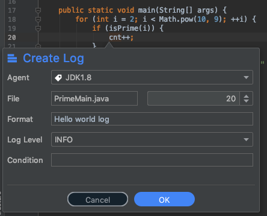

Plugin - User Guide {#_plugin_user_guide}
===================

This section provides an overview of the features available in
Lightrun's IntelliJ plugin.

Logging In {#_logging_in}
----------

After installing Lightrun we can expand the side drawer by clicking on
it. We can then login from the IDE using either the button on the top of
the side drawer or the right click menu option:

::: {.note}
Before logging-in we need to register in the backend server web UI
:::

This triggers the following login dialog:

Once we log in successfully the status button on the top right corner
should turn green:

At this point the right click context menu changes and should include
additional options as such:

Usage {#_usage}
-----

::: {.important}
The plugin will hide options if there are no agents connected to the
backend and no tags
:::

On the right side we see the Lightrun side drawer. It includes a tree of
agents/tags and the actions connected to them:

::: {.tip}
This drawer can be folded to save screen real estate
:::

The drawer includes all the high level information you might need:

We can search within agents and action below and the list updates
immediately based on the search query. When we have multiple logs on
multiple agents this can be very useful.

We have multiple indicators and capabilities for every agent. Most of
these are applicable for actions under tags as well so we'll focus only
on the agent here:

-   Tags --- this is the list of tags for this agent. Notice that it's
    cropped. To see all the tags we will need to expand the drawer or
    click the details (info) icon to see the list of tags there

-   Details --- shows the information dialog for the agent/action

-   Hide Logs --- Logs might be intrusive in the IDE UI. We can
    fold/hide them using this button. Notice it works recursively and
    will apply to the hierarchy below

-   Pipe Logs --- By default Lightrun logs into the same logger used by
    the host applicaion. However, it has 3 modes: `Server Only` (the
    default), `Plugin Only` and `Both`. When set to `Plugin Only` or
    `Both` logs added to this agent will show in the Lightrun console

-   Delete Action --- Allows us to delete an action. Notice that actions
    defined in a tag can be deleted through the tag only

-   Go to Line --- Jumps to the source/line number associated with the
    action

-   Status Indicator --- Indicates the current state of the action. One
    check box indicates the action was submitted to the server. Two
    check boxes indicate that it was received by the agent. Highlighted
    checkboxes indicate that the agent accepted the action and deems it
    valid

-   Log Level Indicator --- Indicates the log level from Info to Error

When we press the details button on an agent we can see the following
dialog with details about the piping mode, tags etc:

This is the equivalent dialog for a log entry:

### Adding an Action {#_adding_an_action}

All actions are added via the right click menu. Select a specific line
in the code, right click and select the appropriate action e.g. Log as
shown here:

There are several options in the new/edit log dialog:

-   Agent --- The agent or tag to which we will bind the action

-   File/Line --- The actions position in the code

-   Format --- This is the actual log string. Notice we can use
    expressions such as `My variable is {var}` including even method
    invocations such as: `Method value: {myMethod() + 5}`

-   Log Level --- One of \"Debug\", \"Info\", \"Warning\" or \"Error\".
    We can then filter the logs based on this level

-   Condition --- an expression that limits the action, this is
    effectively the condition of an `if` statement we can use to limit
    the execution of the action e.g.: `myVar % 7 == 0` will limit the
    log so it will print only for variables that divide by 7

Once we press OK a log is added to the area above the line:

::: {.tip}
The picture on the left can be customized the at
[gravatar.com](https://en.gravatar.com/)
:::

Clicking the log lets us delete or edit it.

Almost all of this applies to the other actions supported by Lightrun.
So we'll review the other options by focusing on how they differ from
logs.

#### Snapshot (Breakpoint) {#_snapshot_breakpoint}

A snapshot is a one time \"breakpoint\" that doesn't block. It just
grabs the stack trace and variables then proceeds on its way.

Format and log level aren't needed in snapshots so they're unavailable
here. However, we have the expression list which lets us pick
expressions we wish to add to the snapshot.

The added snapshot is displayed in the gutter on the left side:

When the snapshot receives a hit it's shown in the bottom area of the
window in the *Lightrun Snapshots* area.

The snapshot result should be familiar to IntelliJ users as it's based
on the design of the debugger UI. The navigable stack trace is on the
left and the variable values are on the right. Watch expressions also
appear on the right hand side.

When the snapshot is deleted the content of the captured stack is also
removed.

#### Counter {#_counter}

We often want to know the number of times a specific line of code was
hit especially in comparison to a different line of code. This can be
very useful in debugging issues and especially in tracking performance
problems.

Counter does just that. It counts every time the given line was reached
and periodically logs that information to the standard logger.

A counter doesn't have a format but it has a name which is used to in
the printouts to distinguish one counter from another.

::: {.tip}
Counter is impacted by the piping mode, so we can pipe the counter calls
to the IDE for convenience
:::

#### Set-Value {#_set_value}

One trick in debugging is the ability to set a variable to a different
value and force a specific code path. In our case this takes a much
deeper meaning of patching broken behavior. E.g. if a feature fails and
it's surrounded by an if statement we might be able to disable that
feature by setting the value of a variable.

This is an extremely risky proposition and as such it requires the
set-value role for a user. Otherwise the feature isn't available or even
visible.

When adding a set-value action we define a left side argument which is
the variable name and a right side element which is the value assigned.
The latter can be any valid expression including a method invocation.

::: {.important}
Quotas aren't imposed on set-value operations and as such the
performance impact can be significant. Use this feature with caution
:::

Lightrun Console/Log Piping {#_lightrun_consolelog_piping}
---------------------------

Lightrun logs are normally printed into the standard logging framework.
This is quite valuable as logs can be seen in the context of
pre-existing log statements which might provide further nuance to solve
the problem.

However, in some cases a developer might want to see the log output in
the IDE. For that we have the Lightrun Console at the bottom of the
screen:

Logs created by Lightrun can be redirected to the console where we can
search and filter them. To do that we need to define log piping which we
define on a per-agent basis.

There are 3 levels of log piping:

-   App

-   Plugin

-   Both

App indicates the logs appear only in the Java application as they do by
default. They just go to the standard logger.

Plugin indicates that logs won't show in the app. Instead they will
display within the console below.

Both indicates that logs wll appear both in the app and in the plugin.

::: {.note}
In order to pipe the logs they need to go from the agent to the backend
server and to the plugin. This process is batched so logs appear in
batches and with some delay
:::
